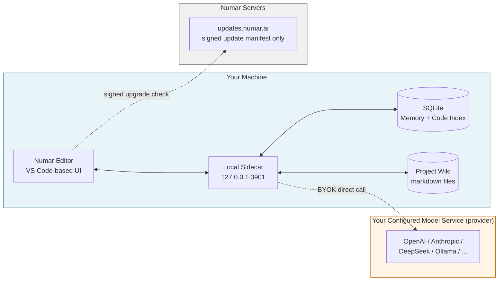
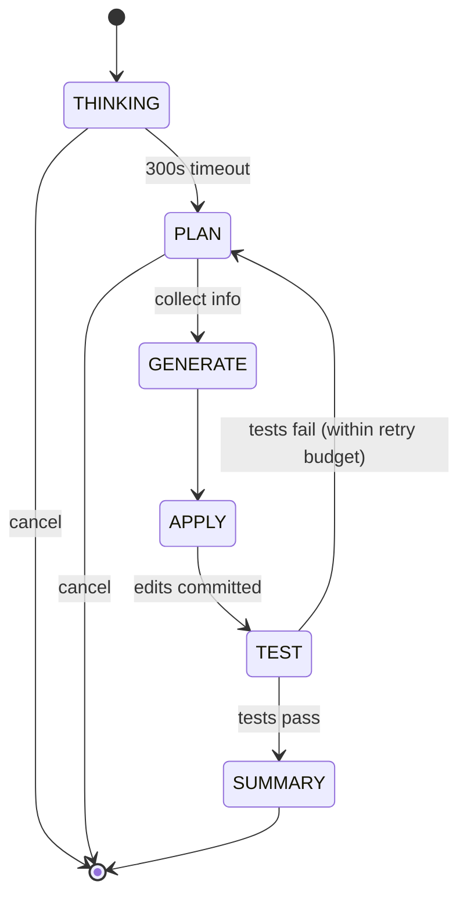
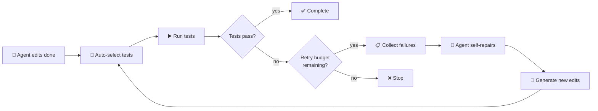

<!-- Language switch -->
**English** · [中文](./README.zh-CN.md)

---

# Numar

An AI-native desktop IDE built on the VS Code foundation.
**BYOK (Bring Your Own Key):** Every AI/model request you make in Numar is sent directly from your machine to the model service (provider) you configure — OpenAI, Anthropic, DeepSeek, GLM (Zhipu), Qwen, Gemini, OpenRouter, local Ollama, or any OpenAI-compatible endpoint. Your requests never pass through Numar's servers.

This repository hosts the **signed binary releases** of Numar. The product itself is closed-source by default; enterprise customers can request source-code review access under NDA (see [FAQ](#faq)).

---

## Table of Contents

- [Design](#design)
- [Architecture at a Glance](#architecture-at-a-glance)
- [Quickstart](#quickstart)
- [Features Walkthrough](#features-walkthrough)
- [Settings Overview](#settings-overview)
- [Updates & Auto-Upgrade](#updates--auto-upgrade)
- [Security & Privacy](#security--privacy)
- [FAQ](#faq)
- [About This Repository](#about-this-repository)
- [License & Contact](#license--contact)

---

## Design

Numar is composed of the following parts:

**1. BYOK + Local Sidecar**
Numar includes a local backend service (`127.0.0.1:3901`) that handles every AI/LLM call. You configure your model service (provider: OpenAI, Anthropic, DeepSeek, GLM (Zhipu), Qwen, Gemini, OpenRouter, local Ollama, or any OpenAI-compatible endpoint) once, and every request is sent from your machine directly to that service. There is no cloud router between Numar and your provider, and Numar's servers do not see the request.

**2. Network Footprint**
Numar performs two classes of outbound network access:

- **Numar official service**: periodic signed upgrade check to `updates.numar.ai` (returns signed manifest only).
- **Your configured model service (provider)**: direct connection when you use AI features.

Diagnostics are written to a local newline-delimited JSON file (`~/.newma/telemetry.ndjson`) and are never uploaded. Conversation memory and code index are stored in local SQLite databases on your machine.

**3. Agent State Machine**
The agent runs through six phases: THINKING → PLAN → GENERATE → APPLY → TEST → SUMMARY. Each phase has its own timeout and round budget, surfaces its current state in the UI, and can be paused, redirected, or cancelled.

**4. Persistent Project Memory**
Each conversation turn is persisted to a local SQLite database, and the agent has a built-in tool that can search past discussions across sessions. Project Memory captures items tied to the current workspace; Global Memory captures items that apply across workspaces. Both are opt-in.

**5. AI-Maintained Engineering Wiki**
Numar can generate and incrementally maintain a project wiki as markdown files inside the project. The wiki is independent of chat history and lives in the repo, so it is version-controlled.

---

## Architecture at a Glance



**What lives where:**

- The blue box (Your Machine) holds the editor, the local sidecar, your code, your conversation history, your memory, your wiki, and your API keys.
- The orange box (Your Provider) is whichever model service (provider) you configured. Every model call is sent here directly from your machine.
- The grey box (Numar Servers) receives only a periodic signed update-manifest request.

---

## Quickstart

### System Requirements

- **macOS 11 (Big Sur) or newer**, Apple Silicon (M1/M2/M3/M4)
- ~500 MB free disk space for the app, plus a few hundred MB for memory/index databases as you use it
- An API key for at least one supported LLM provider (or a local Ollama installation)

> Windows and Linux builds are planned but not yet available.

### 1. Download

Grab the latest macOS asset from the [Releases](https://github.com/NumarAI/numar-releases/releases) page.

### 2. Install

```bash
# Unzip the download
unzip ~/Downloads/Numar-darwin-arm64.zip -d ~/Downloads/

# Move to Applications
mv ~/Downloads/Numar.app /Applications/
```

> **Gatekeeper note.** Numar is signed with an Apple Developer ID and notarized by Apple, so it should open without warnings. If macOS still blocks the first launch, right-click the app and choose **Open**, then confirm.

### 3. Verify the Download (Recommended)

Each release ships with a published SHA-256. Verify before first launch:

```bash
# Compute the hash of what you downloaded
shasum -a 256 ~/Downloads/Numar-darwin-arm64.zip

# Compare against the value on the Releases page
# They MUST match. If they don't, do not run the app and report the issue.
```

### 4. First Run — Bring Your Own Key

On first launch, Numar walks you through configuring at least one LLM provider:

1. Open **Settings ▸ Numar AI ▸ Provider** (or **Settings ▸ Numar**)
2. Pick a model service (provider: OpenAI / Anthropic / DeepSeek / GLM / Qwen / Gemini / OpenRouter / Ollama / OpenAI-compatible custom)
3. Paste your API key
4. Optionally configure separate providers for **Embeddings**, **Vision**, **Search**, and **Wiki** if you want different models for those workloads

The key is stored in your OS keychain. It never leaves your machine except in direct calls to the provider you configured.

### 5. Open Your First Project

`File ▸ Open Folder…` and pick any directory. Open the chat panel (default keybinding: ⌘L on macOS). Pick a mode:

- **Ask** — chat with the model, no edits
- **Agent** — full state-machine agent, edits files, runs tests
- **Plan** — generate a structured plan first, execute per-TODO with your approval

---

## Features Walkthrough

### Chat & Modes

Numar's chat panel is the primary interface. The chat exposes three modes:

| Mode | Behavior | Best For |
|------|----------|----------|
| **Ask** | Pure conversation. No file edits, no tool calls. | Learning a codebase, asking explanations, exploring options. |
| **Agent** | Full pipeline: THINKING → PLAN → GENERATE → APPLY → TEST → SUMMARY. Edits files, runs commands, iterates on failures. | Most coding tasks. |
| **Plan** | Generates a structured plan document with TODOs. Each TODO is then executed and approved individually. | Multi-file refactors, anything destructive, anything you want to review before it happens. |

### Models, Reasoning Effort & Free Models

Register multiple models across providers and switch between them from the chat model picker.

- **Reasoning effort.** For models that support a reasoning/thinking chain, pick an effort level — Low / Medium / High / Extra High — right next to the model. The unified levels map to each provider's native setting (e.g. OpenAI and Anthropic). Effort is hidden for models that only reason optionally when Agent reasoning is turned off.
- **Browse free models.** The Models settings page links to a curated list of free models (currently via OpenRouter) that support tool-calling and coding. Each entry shows its vendor with a link to the official site and a link to get an API key, and can be added with one click. Free tiers are rate-limited, so heavy agent runs may hit provider caps.

### The Agent Pipeline

When you give the agent a task, it walks through visible phases:

1. **THINKING** — high-level analysis, timeboxed (default 300s) and cancellable, optional reasoning mode enables thinking-chain models (DeepSeek-R1, GLM, Qwen-thinking, plus reasoning-capable OpenAI / Anthropic models).
2. **PLAN** — gathers information by calling read-only tools (grep, file read, etc.), then commits to a plan, bounded by max rounds and timeout to prevent infinite loops.
3. **GENERATE** — produces the actual edits.
4. **APPLY** — writes the edits to disk.
5. **TEST** — if Numar Test is enabled, runs your test command and feeds failures back for self-repair.
6. **SUMMARY** — concise recap of what changed and why.

Every phase is shown in the UI. Stopping mid-pipeline is always available.



### Plan Mode

Plan Mode auto-promotes "risky" turns into a structured plan view automatically. Triggers are configurable (see [Settings ▸ Plan Mode](#plan-mode)):

- More than N files affected
- More than N total edits
- At least N new files would be created
- Any destructive operation (move, rename)
- Any sensitive file (`package.json`, `tsconfig*`, `.env*`, CI configs, Dockerfiles, DB migrations, …)

File **deletion** always requires explicit confirmation regardless of settings.

The plan is a real markdown document persisted to your workspace. You can read it, edit it, re-order TODOs, or cancel.

### Numar Test — Self-Repair Loop

After the agent finishes editing, Numar Test can:

1. Automatically pick relevant tests
2. Run them
3. Feed failures back to the agent for one or more self-repair attempts
4. Stop after the configured retry budget

You configure the command template (e.g. `npm test {files}`) and the timeout. Defaults are tuned for typical Node/Python projects and can be overridden per workspace.



### Auto-Compile

For TypeScript/JavaScript projects, enabling auto-compile runs the compiler after each round with typed file modifications. Compile errors are surfaced and (optionally) handed back to the agent as part of the test loop.

### Memory — Two Layers

Numar has two **opt-in** persistent memory layers, both off by default:

- **Global Memory** — cross-workspace personal preferences: interaction style, tone, things that apply regardless of project.
- **Project Memory** — facts and decisions tied to the current workspace: library choices, deadlines, constraints not visible in code.

Memory is stored as markdown files. The agent can read, search, and update entries — and so can you.

### Conversation History & Search

Every conversation turn is persisted to a local SQLite database. The agent has a built-in tool that lets it search past conversations across sessions.

You control:
- Whether new turns are written
- How many recent turns are kept in active context
- The token budget for history
- The strategy when history exceeds budget — truncate vs LLM-summary

### Project Wiki

Numar can generate and incrementally maintain an engineering wiki for your project, independent of the chat. The wiki lives as markdown files inside your repo (so it's version-controlled and reviewable); a dedicated model can be configured for wiki generation if you want a cheaper or larger-context model for that workload.

### Code Index

Numar maintains a local SQLite index of your project source for keyword and (optionally) semantic search. Semantic search requires configuring an embedding provider (for vector embeddings). Both keyword and semantic search are available to the agent as tools and to you via the search UI.

### Cross-Stack Agents (Multi-Window Coordination)

You can link multiple Numar windows on the same machine into a coordinated workspace. Agents in different windows can ask and answer questions across linked workspaces — without any cloud middleman. Useful for monorepo-style work where you want to keep editor instances focused but still let them talk to each other.

### Git in Chat (Changes Panel)

Review and commit agent edits without leaving the chat. The **Changes panel** tracks the files the AI modified in the current chat session — with added/removed line counts and A/M/D/R status badges — and reconciles with source control as the conversation progresses. Three actions are available:

- **Review** — open a multi-file working-tree diff of the listed files.
- **Commit** — stage and commit the listed files.
- **Commit & Push** — commit, then push the current branch to upstream.

Commits are carried out by the agent through its git tools. Protected branches follow confirmation rules (pushes to `master` always confirm), and empty commits or already-up-to-date pushes are skipped automatically.

### Code Review (Advisory)

Numar ships a per-commit AI code reviewer with its own **Code Review** container in the Activity Bar. It reviews a single git commit's diff and writes a structured markdown report — a summary, findings grouped into **Must-fix / Suggestions / Nits**, plus security, correctness, and testing notes — ending with a verdict of `clean`, `needs-attention`, or `blocking-advisory`.

- **Advisory only.** Code Review never blocks a commit or push; it only produces a report.
- **Manual or automatic.** Run *Review Latest Commit* (or review a specific commit) from the view, or opt into auto-review after each commit. Auto-review is gated by configurable thresholds (minimum files and/or lines changed); merge commits, already-reviewed commits, git-ignored files, and excluded paths are skipped. Large diffs are chunked automatically.
- **Reports live outside your repo.** Each report is written to a sibling folder `<project>_CodeReview/`, one markdown file per commit grouped by branch, with a `_meta.json` index — so reviews never pollute your project tree or git history.
- **Its own model (optional).** Point Code Review at a dedicated model / endpoint / key under *Settings ▸ Code Review*, or let it fall back to your primary model.

### Content Language

Numar detects whether you mostly chat in Chinese or English and applies that language to AI-generated prose — Wiki pages, Code Review reports, and summaries — while structural headings stay in English. It is automatic and sticky per workspace; there is no toggle to manage.

### Trusted Commands

Configure a list of terminal commands that the agent is allowed to run without prompting. Everything else asks for confirmation. Auto-approval can also be turned on globally.

---

## Settings Overview

All settings live under **Settings ▸ Numar**. Each panel in the UI has detailed descriptions, defaults, and value ranges — this section is just a map so you know what areas you can tune.

**General** — system notifications; local diagnostics (toggle, retention, size cap); interaction log retention

**Cross-Stack Agents** — whether this window may talk to other Numar windows on the same machine; peer task record retention

**Memory** — toggles for Global Memory and Project Memory (**both off by default**)

**Indexing & Embeddings** — workspace embeddings toggle; embedding model, endpoint (URL), API key

**Vision** — vision model used to describe images when your primary model has no vision support

**Search** — web search provider (model service), endpoint, API key

**Wiki** — dedicated model, endpoint, and API key for project wiki generation

**Code Review** — auto-review toggle; trigger timing (post-commit / post-push); thresholds (minimum files and lines changed); exclude patterns; optional dedicated CR model, endpoint, and key

**Commands & Git** — auto-approve terminal commands toggle; trusted commands whitelist; trusted git operations that skip confirmation; require confirmation for pushes to `master`

**Agents** — max steps per run; PLAN and THINKING phase timeouts and round caps; auto-compile after typed-file edits; reasoning mode and per-model reasoning effort; skip request classification

**Plan Mode** — auto-trigger master switch plus thresholds (file count, edit count, create count, destructive operations, sensitive files)

**Numar Test** — toggle, test command template, timeout, self-repair retry budget

**Context Window** — recent turn count kept in context; history token budget; over-budget strategy (truncate or LLM summary)

**Conversation History** — whether to persist each turn to local SQLite (**on by default**, can be turned off; existing data is kept)

**Code Index** — whether to index project source locally (**on by default**, can be turned off; existing data is kept)

**Remote Configuration** *(in `settings.json`)* — whether to fetch the signed runtime config from the update server; optional endpoint override

**Server** *(advanced)* — local sidecar URL and request timeout

---

## Updates & Auto-Upgrade

Numar checks for updates automatically against `updates.numar.ai`. The check is gated, signed, and conservative:

- **Signed manifests.** Every update manifest is signed with an ed25519 key whose public key is embedded in the app at build time. Manifests that fail verification are rejected.
- **Cohort-based rollout.** Each client computes a stable cohort hash. New releases roll out to a percentage of cohorts first; only versions that prove stable get bumped to 100%.
- **Kill switch.** Releases can be remotely halted if a problem is detected; clients that have not yet upgraded will be told there's nothing new.
- **Two channels.** "Binary update" replaces the full `.app` via Squirrel.Mac. "Core update" can ship targeted JS/runtime fixes without a full reinstall; both are signed independently.

**Manual control:**

- Check for updates: `Numar ▸ Check for Updates…`
- Disable remote runtime config: `numar.remoteConfig.enabled = false`
- Audit what Numar phones home for: **Numar official services side** has only one endpoint (`updates.numar.ai`), which returns nothing but a signed manifest; AI function requests connect directly to your configured model service (provider). You can verify with any HTTP inspection tool.

---

## Security & Privacy

This section lists exactly what Numar stores locally and what it sends over the network.

**What stays on your machine:**

- All source code you open
- All prompts you send to the model
- All model responses
- API keys (stored in the OS keychain)
- Conversation history (local SQLite)
- Project memory and global memory (local markdown)
- Code index (local SQLite)
- Project wiki (markdown files inside your project)
- Diagnostic logs (`~/.newma/telemetry.ndjson`, never auto-uploaded)

**What Numar sends, to whom:**

- **LLM provider you configured** — every model call goes here, directly. Standard rules of that provider apply (e.g. OpenAI's data retention policy).
- **`updates.numar.ai`** — periodic upgrade check, includes platform, version, and a stable opaque cohort hash, returns a signed manifest. **No usage data, no telemetry, no code, no prompts.**

**From a destination perspective, the two main outbound classes are: your configured model service (provider) + `updates.numar.ai`.** When packet-capturing, you'll see AI calls connecting directly to your model service and periodic upgrade check requests. If you enable optional features like web search, you'll also see your configured Search provider destination.

**For enterprise / compliance teams:**

- Source code review under NDA available on request
- Self-hosted update server supported (`numar.remoteConfig.endpoint` override)
- Offline / air-gapped install: disable remote configuration and auto-update in Settings; Numar continues to work indefinitely against locally-configured providers (including local Ollama)

Contact us if you need a formal security questionnaire response.

---

## FAQ

### Is the source code open?

Numar is **closed-source by default**. We are a small focused team and currently ship as a commercial product.

**For enterprise customers**, source-code review access is available under NDA. This is intended for security audits, compliance reviews, and internal verification by your platform/security team. Contact us if your organization needs it.

### Does Numar see my code or my prompts?

**No.** Every LLM call is made by the local sidecar on your machine directly to the provider you configured. Numar's servers are never in the request path. The only thing our servers see is a signed update check (platform + version + opaque cohort hash).

### Does Numar see my API keys?

**No.** Keys live in your OS keychain and are used only by the local sidecar when calling your provider. They are never sent to us.

### How is this different from Cursor / Cline / GitHub Copilot?

- **Cursor** is a hosted IDE. LLM routing, team management, and billing run on its servers.
- **Cline** is a VS Code extension. It runs inside a host editor you provide.
- **GitHub Copilot** is integrated with GitHub-hosted models and the Microsoft ecosystem.
- **Numar** is a desktop IDE. Every LLM call is sent by the local sidecar on your machine directly to the model service (provider) you configure. Numar's own servers receive only periodic signed update-manifest requests.

### Can I use a local model instead of a hosted one?

Yes. Configure Ollama (or any OpenAI-compatible local server) as your provider. Numar's local sidecar will call it on `localhost`. You can run end-to-end with **zero outbound network traffic** except for the upgrade check (which you can also disable).

### Can I run Numar against my company's self-hosted LLM gateway?

Yes. Set the provider URL to your internal gateway endpoint and use whatever auth header your gateway expects.

### Will there be Windows / Linux builds?

Yes, they're on the roadmap. macOS / Apple Silicon is the first supported platform because that's where our earliest users are. Sign up for release notifications or watch this repo for future platform announcements.

### Where can I report a bug or request a feature?

For bugs in the released binaries, open an Issue on this repository. For private security disclosures, contact us via the email below.

### What happens if Numar's servers go down?

Your editor keeps working. The only Numar-side dependency is the upgrade check, which fails gracefully — you can keep using your installed version indefinitely. Model calls go direct to your provider regardless of our server status.

### Why a fork of VS Code rather than a plugin?

A plugin cannot own the chat panel layout, the agent state, the plan-mode UX, the multi-window coordination, or the update channel. Forking makes these first-class. Numar tracks upstream VS Code; its additions are localized to new modules plus a small number of integration points.

---

## About This Repository

This repository (`NumarAI/numar-releases`) is the **public distribution point** for signed Numar binaries. It contains no source code — just GitHub Releases with the `.app.zip` per platform, their SHA-256 manifests, and this README.

> **About the name.** Starting from **v0.0.5**, the product, settings, and UI use **Numar** throughout. Some on-disk paths under your home directory (e.g. `~/.newma/telemetry.ndjson`) retain the legacy `newma` prefix for backward compatibility — they are stable identifiers and won't be renamed in place.

The product source code is hosted privately. The split exists because:

- Distribution should be **public, free, and CDN-backed** — GitHub Releases gives us that for zero cost.
- The Numar update server (`updates.numar.ai`) reads release metadata from this repo, so making it public means anyone can audit what we ship.
- Source code stays private for the reasons in the FAQ above.

If you found this repo by clicking a download link, the latest macOS asset is on the [Releases](https://github.com/NumarAI/numar-releases/releases) page.

---

## License & Contact

**Numar binaries** in this repository are proprietary software. © 2026 Numar. All rights reserved. You may download, install, and use Numar on your own machines for personal or internal business purposes. Redistribution, decompilation, or reverse engineering of the binaries is not permitted.

**This repository's metadata** (README, release notes) is available under the MIT License.

**Contact:** `evenzhi@gmail.com` — for general inquiries, enterprise source-review requests, security disclosures, and bug reports. You can also open an Issue on this repository for non-sensitive bug reports.

---

<p align="center">
  <em>Numar — an AI-native desktop IDE.</em>
</p>
