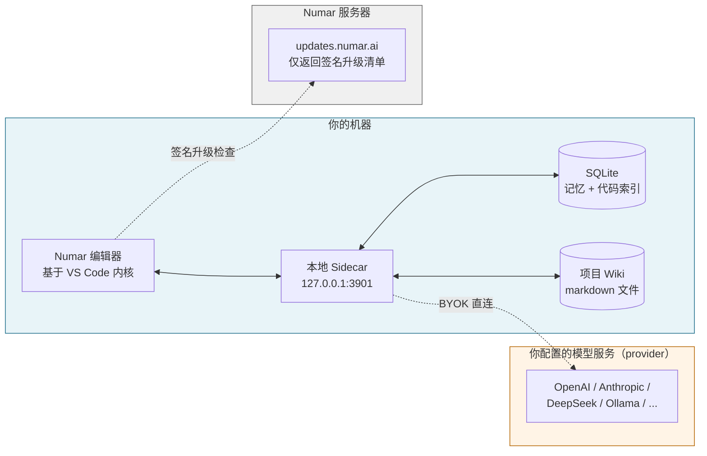
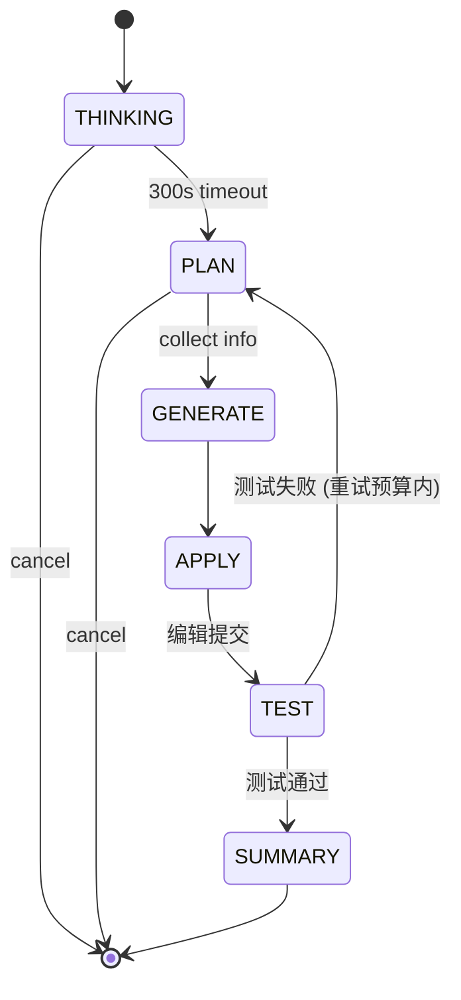
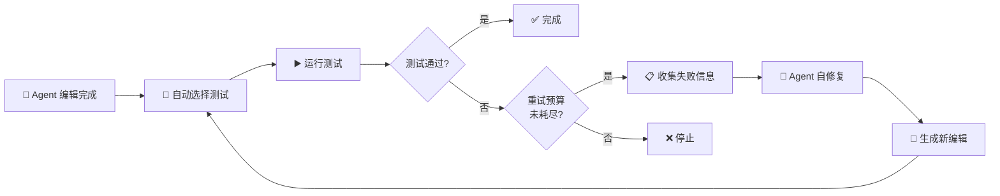

<!-- 语言切换 -->
[English](./README.md) · **中文**

---

# Numar

基于 VS Code 内核构建的 AI-native 桌面 IDE，**BYOK（自备 Key）**：你在 Numar 里发起的所有 **AI/模型请求** 都由你的电脑直接发送到你配置的**模型服务（provider）**（OpenAI / Anthropic / DeepSeek / GLM（智谱）/ Qwen / Gemini / OpenRouter / 本地 Ollama，或任何 OpenAI-compatible 端点），**不会先发到 Numar 的服务器再转发**。

本仓库存放的是 Numar 的**签名二进制版本**，产品本身默认闭源；企业客户可以在签订 NDA 后申请源码审阅（见 [FAQ](#faq)）。

---

## 目录

- [设计](#设计)
- [架构概览](#架构概览)
- [快速开始](#快速开始)
- [功能详解](#功能详解)
- [Settings 速览](#settings-速览)
- [自动升级](#自动升级)
- [安全与隐私](#安全与隐私)
- [FAQ](#faq)
- [关于本仓库](#关于本仓库)
- [许可与联系方式](#许可与联系方式)

---

## 设计

Numar 由以下几部分构成：

**1. BYOK + 本地 Sidecar**
Numar 包含一个本地后端服务（`127.0.0.1:3901`），所有 AI/LLM 调用都从它发起。你配置一次模型服务（provider：OpenAI、Anthropic、DeepSeek、GLM（智谱）、Qwen、Gemini、OpenRouter、本地 Ollama，或任何 OpenAI-compatible 端点），之后每个请求都由你的机器直接发到该模型服务（provider）。Numar 不提供云端中转，服务器也不接收请求内容。

**2. 网络出向**
Numar 会进行两类对外网络访问：

- **Numar 官方服务**：定期向 `updates.numar.ai` 发起**签名升级检查**（返回签名清单）。
- **你配置的模型服务（provider）**：当你使用 AI 功能时，请求由本机直接发送到该模型服务（provider）。

诊断日志写到本地 NDJSON 文件（`~/.newma/telemetry.ndjson`），从不上传；对话记忆和代码索引存储在本机的 SQLite 数据库里。

**3. Agent 状态机**
Agent 走六个阶段：THINKING → PLAN → GENERATE → APPLY → TEST → SUMMARY，每个阶段有自己的超时和轮次预算，当前状态会在 UI 上显示，可被暂停、改方向、取消。

**4. 持久化项目记忆**
每一轮对话都会写入本地 SQLite，Agent 内置工具可以跨会话搜索过去的讨论。Project Memory 保留绑定到当前工作区（workspace）的条目，Global Memory 保留跨工作区（workspace）适用的条目，两者均为可选开启（opt-in）。

**5. AI 自动维护的工程 Wiki**
Numar 可以在项目里增量生成和维护 markdown 形态的工程 Wiki，独立于对话历史，落在仓库（repo）里随 Git 版本管理。

---

## 架构概览



**哪些东西在哪儿：**

- 蓝色框（你的机器）装的是编辑器、本地 Sidecar、你的代码、对话历史、记忆、Wiki、API key
- 橙色框（模型服务/provider）是你配置的模型服务（provider），每次模型调用都由你的机器直接发到这里
- 灰色框（Numar 服务器）只接收周期性的签名升级清单请求

---

## 快速开始

### 系统要求

- **macOS 11（Big Sur）或更新**，Apple Silicon（M1/M2/M3/M4）
- 约 500 MB 磁盘空间装应用，加上几百 MB 的记忆/索引数据库（随使用增长）
- 至少一家模型服务（provider）的 API Key（或本地 Ollama）

> Windows 和 Linux 已在路线图，目前尚未发布。

### 1. 下载

到 [Releases 页](https://github.com/NumarAI/numar-releases/releases) 拿最新的 macOS 包。

### 2. 安装

```bash
# 解压下载下来的 zip
unzip ~/Downloads/Numar-darwin-arm64.zip -d ~/Downloads/

# 拖进 Applications
mv ~/Downloads/Numar.app /Applications/
```

> **Gatekeeper 提醒。** Numar 用 Apple Developer ID 签名并通过 Apple notarize，正常情况打开不会有警告；如果 macOS 第一次启动还是拦了，右键点应用 → 选**打开**，确认即可。

### 3. 校验下载（推荐）

每个版本发布包都附带公开的 SHA-256，首次启动前校验一下：

```bash
# 算一下你下载的文件的 hash
shasum -a 256 ~/Downloads/Numar-darwin-arm64.zip

# 和 Releases 页上贴的值对比
# 必须一致。不一致就别运行，告诉我们。
```

### 4. 首次启动 —— 配你自己的 Key

第一次启动时，Numar 会引导你配置至少一家模型服务（provider）：

1. 打开 **Settings ▸ Numar**
2. 选择模型服务（provider：OpenAI / Anthropic / DeepSeek / GLM / Qwen / Gemini / OpenRouter / Ollama / OpenAI-compatible 自定义）
3. 粘贴你的 API Key
4. 如果想给 **向量嵌入（Embedding）/ 视觉（Vision）/ 搜索（Search）/ Wiki** 配独立模型，也可以单独设置

Key 存在系统 keychain，不会被发送到 Numar 的服务器，只会在本地 Sidecar 直连你配置的模型服务（provider）时用于发起请求。

### 5. 打开第一个项目

`文件 ▸ 打开文件夹…` 选任意目录，打开聊天面板（macOS 默认快捷键：⌘L），选模式：

- **Ask** —— 跟模型聊天，不动文件
- **Agent** —— 完整状态机 Agent，编辑文件、跑命令
- **Plan** —— 先生成结构化的计划，按 TODO 逐项执行并征求你的批准

---

## 功能详解

### 聊天与模式

Numar 的聊天面板是主要的工作界面，提供三种模式：

| 模式 | 行为 | 适合场景 |
|---|---|---|
| **Ask** | 纯对话，不改文件、不调工具 | 学习代码库、求解释、探讨方案 |
| **Agent** | 完整流水线 THINKING → PLAN → GENERATE → APPLY → TEST → SUMMARY；编辑文件、跑命令、按失败迭代 | 大多数编码任务 |
| **Plan** | 先生成结构化的计划文档，每个 TODO 单独执行并征求批准 | 跨多文件的重构、任何破坏性操作、任何你想"先看再改"的事 |

### 模型、推理强度与免费模型

可以注册多家 provider 下的多个模型，并从聊天的模型选择器里随时切换。

- **推理强度（Reasoning effort）。** 对支持推理/思考链的模型，可以直接在模型旁选择强度档位——Low / Medium / High / Extra High。统一档位会映射到各 provider 的原生参数（如 OpenAI、Anthropic）。对"仅可选推理"的模型，当 Agent 推理开关关闭时不显示强度选项。
- **浏览免费模型。** Models 设置页提供入口，列出精选的免费模型（当前经由 OpenRouter），均支持工具调用与编程。每个条目会显示其厂商（带官网链接）和获取 API Key 的链接，可一键添加。免费档有限流，重度 Agent 任务可能很快触达 provider 上限。

### Agent 流水线

当你给 Agent 一个任务，它会走一条可见的阶段路径：

1. **THINKING** —— 高层分析，带超时（默认 300 秒），可取消，可选启用推理（reasoning）模式（DeepSeek-R1、GLM、Qwen-thinking 这类带独立推理链的模型，以及支持推理的 OpenAI / Anthropic 模型）。
2. **PLAN** —— 通过只读（read-only）工具（grep、文件读取等）收集信息，然后定下计划，有最大轮次和超时上限，避免死循环。
3. **GENERATE** —— 产出真正的编辑。
4. **APPLY** —— 把编辑写到磁盘。
5. **TEST** —— 如果开了 Numar Test，自动跑测试命令，把失败信息喂回去让 Agent 自修复。
6. **SUMMARY** —— 简洁回顾改了什么、为什么。

每个阶段在 UI 上都看得到，随时可以中途停。



### Plan Mode

Plan Mode 会自动把"高风险"的请求升级到结构化计划视图，触发条件可配置（详见 Settings 中的 Plan Mode（计划模式）段）：

- 影响超过 N 个文件
- 总编辑数超过 N
- 至少新建 N 个文件
- 任何破坏性操作（移动、重命名）
- 任何敏感文件（`package.json`、`tsconfig*`、`.env*`、CI 配置、Dockerfile、DB migration……）

**删除文件永远需要明确确认**，不受这些开关影响。

计划本身是一份真实的 markdown 文档，落到工作区（workspace）里，你可以读、改、调整 TODO 顺序、取消。

### Numar Test —— 自修复闭环

Agent 改完之后，Numar Test 可以：

1. 自动挑出相关的测试
2. 跑它们
3. 把失败信息喂回 Agent，尝试一次或多次自修复
4. 重试预算用完就停

你配置测试命令模板（例如 `npm test {files}`）和超时，默认值按典型 Node / Python 项目调好，可以按工作区（workspace）覆盖。



### Auto-Compile（自动编译）

对 TypeScript / JavaScript 项目，开启自动编译（auto-compile）之后，每一轮带类型化文件改动的回合都会自动跑编译，编译错误会被显式展示出来，（可选地）作为测试闭环的一部分喂回 Agent。

### Memory —— 两层

Numar 有两层**可选开启（opt-in）**的持久化记忆，**都默认关闭**：

- **Global Memory** —— 跨工作区（workspace）的个人偏好：交互风格、语气、不绑定到具体项目的偏好
- **Project Memory** —— 绑定到当前工作区（workspace）的事实和决策：库选型、截止日期、代码里看不出来的约束

记忆以 markdown 文件存储，Agent 可以读、搜、更新，你也一样。

### 对话历史与搜索

每一轮对话都会被写入本地 SQLite，Agent 内置一个工具，可以跨会话搜索过去的对话。

你可以控制：
- 是否写入新轮次
- 保留多少最近轮次在活跃上下文（context）里
- 历史 token 预算
- 超预算时的策略——截断或 LLM 摘要

### 项目 Wiki

Numar 可以为你的项目增量生成和维护一份工程 Wiki，独立于对话历史，以 markdown 落到仓库（repo）里（带版本管理、可审阅）。如果你想用更便宜或更大上下文的模型专门跑 Wiki 生成，可以单独给 Wiki 配模型服务（provider）。

### 代码索引

Numar 在本地 SQLite 维护一份项目代码的索引，支持关键字搜索和（可选）语义搜索，语义搜索需要配置向量嵌入模型服务（embedding provider）。两种搜索都对 Agent 作为工具开放，也对你通过搜索 UI 开放。

### Cross-Stack Agents（多窗口协同）

你可以把同一台机器上的多个 Numar 窗口连成一个协同工作区（workspace），不同窗口里的 Agent 可以跨工作区（workspace）提问和回答——全程不经过云。适合单仓库（monorepo）这类想保持编辑器实例聚焦、但又希望它们之间能对话的场景。

### 聊天内 Git（Changes 面板）

不离开聊天就能审阅并提交 Agent 的改动。**Changes 面板**按当前会话跟踪 AI 修改过的文件——带增/删行数和 A/M/D/R 状态标记——并随对话推进与源代码管理对账。提供三个动作：

- **Review** —— 打开这些文件的多文件工作区 diff。
- **Commit** —— 暂存并提交这些文件。
- **Commit & Push** —— 提交后把当前分支推到上游。

提交由 Agent 通过其 git 工具执行；受保护分支遵循确认规则（推送到 `master` 一律需确认），空提交或已是最新的 push 会被自动跳过。

### Code Review（代码审查，建议性）

Numar 内置一个按 commit 的 AI 代码审查器，在活动栏有独立的 **Code Review** 容器。它审查单个 git commit 的 diff，产出结构化的 markdown 报告——摘要、按 **Must-fix / Suggestions / Nits** 分组的发现项，以及安全性、正确性、测试相关的说明——最后给出结论：`clean`、`needs-attention` 或 `blocking-advisory`。

- **仅供参考。** Code Review 从不阻断 commit 或 push，只产出报告。
- **手动或自动。** 在视图里运行 *Review Latest Commit*（或审查指定 commit），也可开启每次提交后自动审查。自动审查受可配置阈值门控（最少改动文件数 / 行数）；合并提交、已审查过的提交、被 git 忽略的文件、以及排除路径都会跳过。大 diff 会自动分块。
- **报告存在仓库之外。** 每份报告写到项目**同级目录** `<项目>_CodeReview/`，按分支分文件夹、每个 commit 一个 markdown 文件，另有 `_meta.json` 索引——审查内容不会污染你的项目树或 git 历史。
- **可用独立模型（可选）。** 在 *Settings ▸ Code Review* 给 Code Review 配独立的模型 / endpoint / key，或让它回退到你的主模型。

### Content Language（内容语言）

Numar 会识别你主要用中文还是英文聊天，并把该语言套用到 AI 生成的正文——Wiki 页面、Code Review 报告、摘要——同时结构性标题保持英文。它全自动、按工作区（workspace）粘性记忆，无需手动开关。

### Trusted Commands

配一份白名单，列出 Agent 可以不弹窗直接执行的终端命令，其它都会先问你，也可以全局开启自动批准。

---

## Settings 速览

所有设置都在 **Settings ▸ Numar** 下，每个面板在 UI 里都有详细说明、默认值和可选范围——这里只给你一张地图，让你知道**哪些方面可以自己调**。

**General（通用）** —— 系统通知；本地诊断（开关、保留天数、大小上限）；交互日志保留天数

**Cross-Stack Agents（多窗口协同）** —— 是否允许本窗口与同机器其它 Numar 窗口通讯；对等（peer）任务记录保留数

**Memory（记忆）** —— 全局记忆（Global）与项目记忆（Project）的总开关（**两者默认都关**）

**Indexing & Embeddings（索引与向量嵌入）** —— 工作区（workspace）向量嵌入总开关；嵌入模型、端点（endpoint）、API Key

**Vision（视觉）** —— 主模型不支持视觉时，用于图像描述的独立模型

**Search（搜索）** —— 网页搜索的模型服务（provider）、端点（endpoint）、API Key

**Wiki（工程 Wiki）** —— Wiki 生成可单独配置的模型、端点（endpoint）、API Key

**Code Review（代码审查）** —— 自动审查开关；触发时机（post-commit / post-push）；阈值（最少改动文件数、行数）；排除模式；可选的独立 CR 模型、端点（endpoint）、API Key

**Commands & Git（命令与 Git）** —— 终端命令自动批准总开关；可信命令白名单；可跳过确认的可信 git 操作；推送到 `master` 强制确认

**Agents（Agent）** —— 单次最大步数；PLAN 与 THINKING 阶段超时和轮次上限；类型化编辑后自动编译；推理（reasoning）模式与按模型的推理强度；跳过请求分类

**Plan Mode（计划模式）** —— 自动触发总开关与阈值（文件数、编辑数、创建数、破坏性操作、敏感文件）

**Numar Test（测试）** —— 总开关、命令模板、超时、自修复重试上限

**Context Window（上下文窗口）** —— 最近轮次数；历史 token 预算；超预算策略（截断或 LLM 摘要）

**Conversation History（对话历史）** —— 是否写入本地 SQLite（**默认开**，可关，已有数据保留）

**Code Index（代码索引）** —— 是否在本地索引项目代码（**默认开**，可关，已有数据保留）

**Remote Configuration（远程配置）** *（在 `settings.json` 里）* —— 是否从升级服务器拉取签名运行时配置；可覆盖端点

**Server（服务）** *（高级）* —— 本地 Sidecar 地址和请求超时

---

## 自动升级

Numar 会自动向 `updates.numar.ai` 检查更新，检查机制严控、签名、保守：

- **签名清单**：每份升级清单都用 ed25519 签名，公钥在打包时嵌入应用，验签失败的清单直接拒绝。
- **基于 cohort 的灰度**：每个客户端计算一个稳定的 cohort hash，新版本先放给一部分 cohort，跑稳了再 ramp 到 100%。
- **Kill Switch**：发现问题可以远端急刹，还没升级的客户端会被告知"没有新版本"。
- **双通道**："Binary update" 通过 Squirrel.Mac 替换整个 `.app`，"Core update" 可以发热修复（JS / 运行时层）不需要全量重装；两者独立签名。

**手动操作：**

- 检查更新：`Numar ▸ Check for Updates…`
- 关闭远端运行时配置：在 Settings 里把它关掉
- 审计 Numar 向哪发请求：**Numar 官方服务侧**只有一个端点（`updates.numar.ai`），返回的只是签名清单；AI 功能请求会直连你配置的模型服务（provider），任何 HTTP 抓包工具都能验证

---

## 安全与隐私

这一节列出 Numar 在本地存什么、通过网络发什么。

**留在你机器上的：**

- 你打开的所有源码
- 你发给模型的所有提示词（prompt）
- 模型的所有回复
- API key（存系统 keychain）
- 对话历史（本地 SQLite）
- Project Memory 和 Global Memory（本地 markdown）
- 代码索引（本地 SQLite）
- 项目 Wiki（落到项目里的 markdown）
- 诊断日志（`~/.newma/telemetry.ndjson`，永不自动上传）

**Numar 主动发的，发给谁：**

- **你配置的模型服务（provider）** —— 每个模型调用直接发到这里，适用该 provider 的数据策略（data policy，例如 OpenAI 的保留策略）。
- **`updates.numar.ai`** —— 周期性升级检查，带平台、版本、一个稳定的不透明 cohort hash，返回签名清单，**不含使用数据、埋点、代码或提示词（prompt）**。

**从目的地来看，对外主要就是这两类：你配置的模型服务（provider） + `updates.numar.ai`。** 抓包时，你会看到 AI 调用直连模型服务（provider），以及周期性的更新检查请求。若你启用了网页搜索等可选能力，还会出现你所配置的搜索服务（Search provider）目的地。

**给企业 / 合规团队：**

- 签 NDA 后可申请源码审阅
- 支持自建升级服务器（在 Settings 里覆盖端点）
- 离线 / 隔离网络部署：在 Settings 里关掉远程配置（remote configuration）和自动升级，Numar 可以无限期跑在本地配置的模型服务（provider）上（包括本地 Ollama）

如果你需要正式的安全问卷回复，联系我们。

---

## FAQ

### 源码开放吗？

Numar 目前**默认闭源**，我们是个聚焦的小团队，目前以商业产品形态发售。

**企业客户**可在签订 NDA 后申请源码审阅，用于安全审计、合规审查、平台/安全团队的内部验证，需要的话联系我们。

### Numar 能看到我的代码或提示词（prompt）吗？

**不能，** 每个 LLM 调用都是本地 Sidecar 在你机器上直接发给你配置的模型服务（provider），**不会先发到 Numar 服务器再转发**，我们服务器看到的只是签名升级检查（平台 + 版本 + 不透明 cohort hash）。

### Numar 能看到我的 API key 吗？

**不能，** Key 存在系统 keychain，只在本地 Sidecar 调你的模型服务（provider）时使用，从不发给我们。

### 和 Cursor / Cline / GitHub Copilot 有什么不同？

- **Cursor** 是托管型 IDE，LLM 路由、团队管理、计费都在它的服务器上运行。
- **Cline** 是 VS Code 扩展，运行在你自己提供的宿主编辑器里。
- **GitHub Copilot** 集成 GitHub 托管的模型和 Microsoft 生态。
- **Numar** 是桌面 IDE，每一次 LLM 调用都由机器上的本地 Sidecar 直接发到你配置的模型服务（provider），自身服务器只接收周期性的签名升级清单请求。

### 能用本地模型代替托管的吗？

可以，把 Ollama（或任何 OpenAI-compatible 的本地服务）配为模型服务（provider），Numar 的本地 Sidecar 会通过 `localhost` 调用它。端到端可以做到**除升级检查外零出向流量**（升级检查也能关）。

### 能让 Numar 调公司自建的 LLM 网关（gateway）吗？

可以，把模型服务（provider）的 URL 设成你内部网关（gateway）的端点，按网关要求的鉴权头（auth header）走就行。

### 会有 Windows / Linux 版本吗？

会，已在路线图。macOS / Apple Silicon 是第一个支持的平台，因为我们最早的用户在那儿。订阅版本更新通知或关注（watch）本仓库，可以第一时间看到平台扩展。

### Bug 和功能请求去哪反馈？

二进制相关 bug 请在本仓库提 Issue，私密的安全问题请发邮件到下方联系方式。

### Numar 服务器挂了会怎样？

你的编辑器照常工作。Numar 这边唯一的依赖是升级检查，失败会优雅降级——已经装上的版本可以无限期继续用。模型调用直接打你的模型服务（provider），跟我们服务器状态无关。

### 为什么要 fork VS Code 而不是做个插件？

插件无法完全掌控聊天面板布局、Agent 状态、Plan 模式 UX、多窗口协同、升级通道，fork 是把这些做成一等公民的方式。Numar 跟随 VS Code 上游，自己加的代码集中在新增模块和少量集成点上。

---

## 关于本仓库

本仓库（`NumarAI/numar-releases`）是 Numar 签名二进制的**公开分发点**，不含源码——只有 GitHub Releases 上的 `.app.zip`（按平台）、对应的 SHA-256 清单、以及这份 README。

> **关于命名。** 从 **v0.0.5** 起，产品、Settings 和 UI 全部使用 **Numar** 品牌。用户主目录下的部分本地路径（如 `~/.newma/telemetry.ndjson`）保留旧 `newma` 前缀以兼容已有安装——这些是稳定的磁盘标识符，不会就地改名。

产品源码私有托管，这种拆分的原因：

- 分发应该是**公开、免费、CDN 兜底**的——GitHub Releases 给我们零成本拿到这一切。
- Numar 升级服务器（`updates.numar.ai`）从本仓库读版本发布元数据，公开本仓库就意味着任何人都能审计我们发布了什么；
- 源码保持私有，原因见上面 FAQ。

如果你是点了下载链接到这里的，最新 macOS 包在 [Releases 页](https://github.com/NumarAI/numar-releases/releases)。

---

## 许可与联系方式

**本仓库中的 Numar 二进制**是专有软件，© 2026 Numar，保留所有权利；你可以在自己的机器上下载、安装、用于个人或公司内部用途，不允许再分发、反编译、逆向工程。

**本仓库的元数据**（README、发布说明/release notes）采用 MIT License。

**联系方式：** `evenzhi@gmail.com` —— 一般咨询、企业源码审阅申请、安全披露、Bug 反馈都用这个，非敏感的 Bug 也可以直接在本仓库提 Issue。

---

<p align="center">
  <em>Numar —— AI-native 桌面 IDE</em>
</p>
